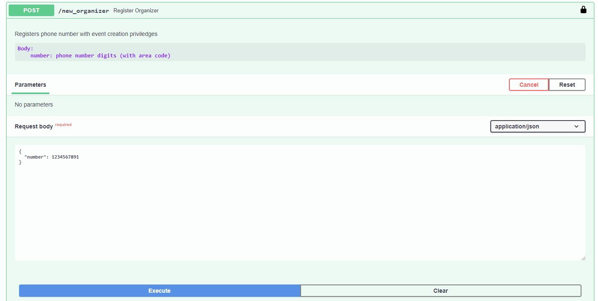
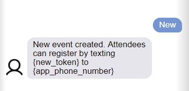
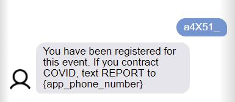
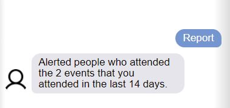
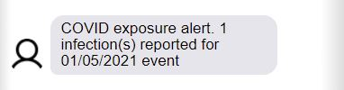

# SMS Contact Tracing App
An application using the twilio api to let people sign up for covid exposure alerts. 
The motivation for making this was mostly educational since I wanted to learn how to send programable texts while also making something functional. If you find it useful, you can may use this code to deploy your own contact tracing sms bot (at your own risk).

# How it works
There are three types of users for this app:
- Admin: can register users who can organize "events"
- Event Organizers: Users who can text "New" to the app number to create an event
- Attendees: Users who can sign up for the event using sms. They receive a text alert if an an event exposure has been reported

## Registering Event Organizers
As an admin you can register users who have event creation priviledges. This is done through the web api. The api has an open-api UI that can be used for this purpose. The POST request for this action is protected through an API key. The open-api UI can handle the authentification.

## Creating an Event: 
If your phone number is registered as an "event organizer" you can text "New" to the app number and it will create an event entry in the database. You will receive a reply explaining how attendees can sign up for the event. The event token is generated for each new event, and the app phone number is a number purchased from twilio. 

## Signing Up for an Event
The event organizer can share the token and app phone number to the people who attend the event. They simply have to text the token to the app phone number to register. 

## Reporting an Infection
Anyone who attended an event can text REPORT to the app number. The app will find the events that the user attended in the last two weeks, and notify everyone who also attended those events. 

## Getting Notified
Once an infection is reported, the exposed users will get notified through SMS.

# Deploying the app:
Twilio has some restrictions on creating sms bots (for very good reasons). To deploy the app, you will probably have to get it approved.
1. Create a Twilio account and get the following:
    - Account SID
    - twilio api token
    - twilio phone number 
2. Deploy your own version of the app by clicking below: 
    - 
3. Once the app is deployed, you will have to connect your twilio phone number to the webhook address that handles the messaging logic {your_app_addres}/hook. 
